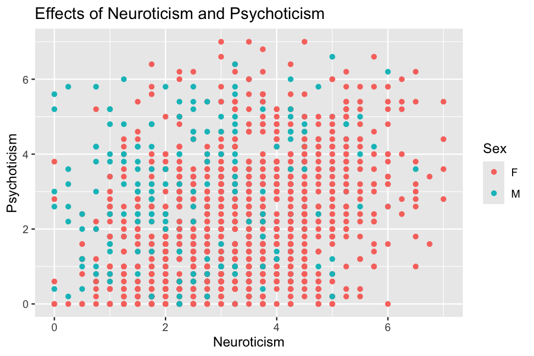

Personality_Analysis_Final_Data_Project
================
Ben Smith
2025-09-25

\#Disclaimer For my final project I really wanted to find something
neuroscience related. It is remarkably hard to find data that meets all
of the criterion, related to my field of interest, public access, clean
and easily interprettable data that can be imported into R. I found a
great data set with lots of observations and variables but honestly it
was over my head and hard to understand what was going on. While the
data was open access, there weren’t great explanations of all the data
collected. I was reluctant to use a dataset I didn’t really understand
but started doing preliminary exploration and found out that they had
transformed and normalized values for EMG data. So I found one of the
only R packages that has neuroscience datasets, the neuropsychology
package. Unfortunately there is really no reliable explanations on how
the variables were tested. For example they will have numerical data for
“Empathy & Agreeableness” but I have no idea what kind of survey or test
was conducted to get these values. That being said it is the best data I
can find related to neuroscience so we shouldn’t take anything too
seriously as I can’t back up any claims I find as I don’t know how the
data was collected.

``` r
# Load dataset (archived from neuropsychology package)
tmpfile <- tempfile(fileext = ".tar.gz")
download.file(
  "https://cran.r-project.org/src/contrib/Archive/neuropsychology/neuropsychology_0.5.0.tar.gz",
  destfile = tmpfile, mode = "wb"
)
td <- tempdir()
untar(tmpfile, exdir = td)
cand <- list.files(td, pattern = "personality\\.(rda|RData|rds)$",
                   recursive = TRUE, full.names = TRUE, ignore.case = TRUE)
load(cand[1])  # loads `personality`
```

``` r
library(ggplot2)
library(broom)
library(car)
```

\##Introdcution

For this project I will be using the personality data set from the
neuropsychology package.The personality data is on personality traits
and was collected from normal and “pathological” subjects from an online
questionnaire. While we don’t know much about the validity of the data,
by looking at the structure of the data we can see that it has multiple
categorical data and numerical that satisfy the needs of this project.

``` r
str(personality)
```

    ## 'data.frame':    1327 obs. of  20 variables:
    ##  $ Sex                             : Factor w/ 2 levels "F","M": 1 2 1 1 1 1 2 1 2 1 ...
    ##  $ Age                             : num  25 25.9 22.2 27.3 49 ...
    ##  $ Salary                          : int  2 3 0 2 3 3 0 0 2 0 ...
    ##  $ Study_Level                     : int  6 6 5 6 6 5 3 6 6 6 ...
    ##  $ Mood_Disorder                   : Factor w/ 2 levels "Absence","Presence": 1 1 1 1 1 1 1 1 2 1 ...
    ##  $ BMI                             : num  22.6 21.9 23.1 18.6 21.2 ...
    ##  $ Meditation                      : Factor w/ 2 levels "No","Yes": 1 1 2 1 1 2 1 1 1 1 ...
    ##  $ Sport                           : Factor w/ 2 levels "No","Yes": 1 2 2 1 2 1 2 2 2 1 ...
    ##  $ Music                           : Factor w/ 2 levels "No","Yes": 1 2 1 1 2 1 2 1 1 1 ...
    ##  $ Extraversion                    : num  4.75 3.25 5.5 5 2.75 2.75 6.25 4.75 2.25 4.5 ...
    ##  $ Empathy.Agreeableness           : num  3.5 3.5 6.5 4.75 6.25 3.5 6 7 6 6.25 ...
    ##  $ Conscientiousness               : num  2.25 2.25 3.75 0.75 2.25 2.75 4.75 5.75 5.75 3 ...
    ##  $ Instability.Neuroticism         : num  4.75 2 3.25 3.5 2 4.75 4.5 3 2.25 5.75 ...
    ##  $ Openness_to_Experience.Intellect: num  3.75 4 6 5.25 4.5 2.5 6 4 5.5 5 ...
    ##  $ Honesty.Humility                : num  1 4.75 7 7 7 6.5 5.5 6.25 6.25 6.5 ...
    ##  $ Disinhibition                   : num  5.8 2 3.2 4.8 1 2.4 3.6 1.2 1.8 2.2 ...
    ##  $ Detachment                      : num  2.8 2.2 1 0.2 2.4 2 1.6 0.2 1.2 0.8 ...
    ##  $ Psychoticism                    : num  4 1.4 2.6 0.2 2.6 2.4 3.8 0.2 1.2 1 ...
    ##  $ Negative_Affect                 : num  6.2 2.4 2.2 1.6 2 4.2 4.2 0.4 4.4 4.8 ...
    ##  $ Antagonism                      : num  4.6 2.6 1.4 2.8 2 1.2 3.4 1.2 1.6 1 ...

Time to explore some of the data, we will start with something basic
like salary. Salary is often looked at as a response variable. A classic
example to start with to visualize our data is salary against education.
Study level is broken into 7 subcategories with 3 being a highschool
degree, 5 a bachelor degree, 6 masters, 7 doctorate. Below high school
education we have no degree (0), secondary education degree (1) and
youth training (2; maybe an apprenticeship program). It would be very
nice if we had the actual profession as well because it would be
interesting to see what the point in the upper lefthand corner
corresponds to. It is curious to see a subject with no degree having the
same salary as doctorates. We see dense clustering around 0 on the
salary axis throughout education levels 3-6. It is hard to know exactly
why we see this, it could be due to sampling variability, or how the
survey was conducted. There could be problems with the population that
the survey was distributed to and there may be some survey bias.

``` r
ggplot(personality, aes(y = Salary, x = Study_Level)) + geom_jitter() +ggtitle("Effects of Educational Achievement on Salary") + xlab("Education Level")
```


Another interesting question would be how does the level of psychoticism
affect salary? We will explore the relationship between psychoticism and
salary with a scatter plot (psychoticism is numerical not categorical).
The scatterplot below may not be exactly what you expect to see, but we
do see that the higher we go on the psychoticism axis the less data
points we have at higher salaries however, just like in the previous
graph exploring salary and education, the overwhelming majority of the
salary data is below 2 which may suggest our sample of salary is lacking
in data for wealthier survey participants.

``` r
ggplot(personality, aes(y = Salary, x = Psychoticism)) + geom_jitter() + ggtitle("Effects of Psychoticism on Salary")
```


Let’s see what happens when we add gender as an explanatory variable to
the graph we just created. The below graph seems to have a pretty even
spread of gender throughout psychoticism level but it does seem we have
more females in general.

``` r
ggplot(personality, aes(y = Salary, x = Psychoticism, color = Sex)) + geom_jitter() + ggtitle("Salary Against Gender and Psychoticism")
```


The previous graph suggested that there were more females in this
dataset than males, we can see if this is true by making a simple table,
and as we can see we have far more females than males in this dataset.
While it would be interesting to have gender as a categorical
explanatory variable, we may want to shy away from this given that there
are almost 4 times as many women than men in the dataset.

``` r
table(personality$Sex) 
```

    ## 
    ##    F    M 
    ## 1053  274

While there is a large disparity in the counts for gender, we can try an
work around this by creating a contingency table with percentages. Below
is a contingency table exploring gender and mood disorder.

``` r
Gender_Mood_Table <- table(personality$Sex, personality$Mood_Disorder)
Gender_Mood_Table <- cbind(Gender_Mood_Table, rowSums(Gender_Mood_Table), rowSums(Gender_Mood_Table)/sum(Gender_Mood_Table))
colnames(Gender_Mood_Table) <- c("Absence", "Presence", "Totals", "Percentages")
Gender_Mood_Table
```

    ##   Absence Presence Totals Percentages
    ## F     941      112   1053   0.7935192
    ## M     245       29    274   0.2064808

Luckily we caught the imbalance in gender in the dataset however, I
think it is important to keep exploring the data and see what else we
cand find. While we don’t have data on any medications, it is well known
that certain mood altering medications (mostly antipsychotics) can alter
metabolism and lead to weight gain. Additionally we are not told what
mood disorder really means and what the criteria for having a mood
disorder are. Just for the sake of thoroughness I thought it would be
interesting to see whether having a mood disorder or not could influence
BMI as is shown in the boxplot below. There doesn’t seem to be any
noticeable diferences between absence or presence.

``` r
ggplot(personality, aes(y = BMI, x = Mood_Disorder)) + geom_boxplot() + ggtitle("Effects of Mood Disorder on Body Mass Index") + xlab("Mood Disorder")
```


One relationship that should jump out and seem obvious to us is the
relationship between Psychoticism and if the participant has a mood
disorder or not. Not surprsingly there does seem to be a difference
between having and not having a mood disorder on the level of
psychoticism. The median score on the psychoticism scale for Absence is
2 while the median score for subjects who have a mood disorder is 3.

``` r
ggplot(personality, aes(y = Psychoticism, x = Mood_Disorder)) + geom_boxplot() + ggtitle("Effects of Mood Disorder on level of Psychoticism") + xlab("Mood Disorder")
```


If we had good data on both genders the next obvious explanatory
variable to add to the previous graph would be gender. Although we lack
a good sample of Males, we will see what happens when we factor gender
into the previous plot.

``` r
ggplot(personality, aes(y = Psychoticism, x = Mood_Disorder, color = Sex)) + geom_boxplot() + ggtitle("Psychoticism Scores Grouped by Presence/Absence of Mood Disorder & Gender") + xlab("Mood Disorder")
```


To test some of the other data, we should pick some relationships we
would expect to have correlations to see how normal the sample is. For
example, one would assume that someone who scores high on antagonism
would probably score low on Honesty and Humility and that we may see a
negative trend in this relationship. Below is a scatterplot of
Antagonism against Honesty and Humility. Sure enough we see a negative
trend, the general relationship is the higher you rank on honesty and
humility the lower your antagonism score is and vice versa. However, it
should be noted that there is some fanning of the data with more results
for high Honesty and humility than results for Antagonism.

``` r
ggplot(data = personality, aes(y = Antagonism, x = Honesty.Humility)) + geom_point() + xlab("Honesty & Humility") + ggtitle("Antagonism against Honesty & Humility")
```


We are starting to get a good grasp on the data, I like the idea of
investigating some of the personality traits that are more seriously
related to possible mental illness such as psychoticism, neuroticism,
negative affect, and detachment. Since we have done some exploration on
psychoticism (a very serious mental condition that often is accompanied
by schizophrenia), let’s explore negative affect quickly. People who
have a high negative affect have a higher propensity to experience
negative feelings and tend to have a more negative experience of their
surroundings in general. For this reason there may be a relationship
between negative affect and neuroticism. Briefly, neuroticism is
considered one of the big five personality traits in psychology, and a
brief wikipedia search of neuroticism makes claims about high
neuroticism scores being associated with anxiety, depression, anger,
fear and an increased risk for mood disorders. Let’s explore our data
and see if we can find anything similar to those claims.

``` r
ggplot(personality, aes(y = Instability.Neuroticism, x = Negative_Affect)) + geom_point() + ggtitle("Level of Negative Affect on Severity of Neuroticism") + ylab("Neuroticism") + xlab("Negative Affect")
```


As we can see from the plot above there indeed does seem to be a
positive trend between negative affect and Neuroticism. Let’s continue
to explore negative affect and see how it may relate to the level of
psychoticism. Here we will put Neuroticism on the x axis because it
makes more sense that neuroticism could predict psychosis than the other
way around.

``` r
ggplot(personality, aes(y = Psychoticism, x = Instability.Neuroticism, color = Sex)) + geom_point() + ggtitle("Effects of Neuroticism and Psychoticism") + xlab("Neuroticism")
```



There are just two more variables I would like to visualize with
psychoticism, disinhibition and detachment. Disinhibition is a hallmark
of many different mental illnesses. Basically disinhibition is exactly
what it sounds like, trouble controlling and inhibiting certain actions,
sometimes called impulsivity, disinhibition can have large real life
effects like poor risk management. Let’s see how the two may relate.

``` r
ggplot(personality, aes(y =Psychoticism, x = Disinhibition, color = Sex )) + geom_point() + ggtitle("Psychoticism against Disinhibition") 
```


While there may be some heteroscedasticity (there certainly is an uneven
spread), there does seem to be a positive trend between Disinhibition
and Psychoticism. Finally let’s look at detachment and psychoticism,
detachment is the inability to connect emotionally with others. This can
happen naturally or can be done delibrerately as an avoidance measure.

``` r
ggplot(personality, aes(y = Psychoticism, x = Detachment, color = Sex)) + geom_point() + ggtitle("Psychoticism against Detachment")
```


This graph is very similar to psychoticism against disinhibition and
without more data on men it is hard to tell if there is a lot of
difference between genders.

\##Multiple Regression

We will use psychoticism as our numerical response variable and use
detachment and gender as our explanatory variables.

``` r
#building the regression model
Psych_detachment <- lm(Psychoticism ~ Detachment + Sex, data = personality)
Psych_detachment
```

    ## 
    ## Call:
    ## lm(formula = Psychoticism ~ Detachment + Sex, data = personality)
    ## 
    ## Coefficients:
    ## (Intercept)   Detachment         SexM  
    ##      1.1339       0.5962       0.3644

It is probably a good idea to check our numerical variables for normal
distribution

``` r
ggplot(personality, aes(x = Psychoticism)) + geom_histogram(binwidth = .5) + ggtitle("Psychoticism Counts")
```


``` r
ggplot(personality, aes(x = Detachment)) + geom_histogram(binwidth = .5) + ggtitle("Histogram of Detachment Scores")
```


There is defintely some right skew in both of the histograms. We can use
the symbox command to see if any transformations could help the data
appear more normal. We will hold off on that for now though and just
proceed with the model we have.

We have already created some scatter plots of the data but let’s check
the residuals and get an indea of influential points and possible
outliers.

``` r
plot(Psych_detachment, which = 1:2)
```


While the Quantile plot doesn’t look terrible, the Residual plot isn’t
great. The models predictions are not a great fit. There is a slight bit
of fanning and the data isn’t that evenly distributed. Let’s check out
the Cook’s distances which is another direct measure of influence
(discrepency x Leverage). The influence plot with cooks distances
respresented by the size of the bubble is a little overwhelming when we
have this much data.

``` r
influencePlot(Psych_detachment)
```


    ##        StudRes         Hat       CookD
    ## 103 -2.5377181 0.009233823 0.019924852
    ## 234 -0.7824642 0.010911074 0.002251993
    ## 422 -1.2376659 0.011534468 0.005955898
    ## 445 -2.4483527 0.009126784 0.018335434
    ## 723  3.2033086 0.001064204 0.003618566
    ## 769  3.3985540 0.001942251 0.007433099

\#Multiple Regression Anova

Below is the output from the anova command. Detachment has a huge F
value and a ridiculously small p-value indicating detachment is a
significant predictor of psychoticism. Sex also has a significanct p
value but a much smaller F score and value overall, so it helps explain
the level of psychoticism but not a strongly as detachment in this
model.

``` r
anova(Psych_detachment)
```

    ## Analysis of Variance Table
    ## 
    ## Response: Psychoticism
    ##              Df  Sum Sq Mean Sq F value    Pr(>F)    
    ## Detachment    1  677.78  677.78 332.599 < 2.2e-16 ***
    ## Sex           1   28.63   28.63  14.048 0.0001859 ***
    ## Residuals  1324 2698.10    2.04                      
    ## ---
    ## Signif. codes:  0 '***' 0.001 '**' 0.01 '*' 0.05 '.' 0.1 ' ' 1

``` r
library(dplyr)
Psych_means <- personality %>% group_by(Detachment, Sex) %>% summarize(mean_psych = mean(Psychoticism))
head(Psych_means)
```

    ## # A tibble: 6 × 3
    ## # Groups:   Detachment [3]
    ##   Detachment Sex   mean_psych
    ##        <dbl> <fct>      <dbl>
    ## 1        0   F          0.847
    ## 2        0   M          1.4  
    ## 3        0.2 F          1.07 
    ## 4        0.2 M          1.93 
    ## 5        0.4 F          1.8  
    ## 6        0.4 M          2.11

Now we can make an interaction plot. It is a messy plot given the sheer
amount of data we have and it isn’t just a simple low middle and high
explanatory variable on the x axis which makes it hard to follow and see
if there are parrallel lines. I see differential slopes but I also do
see some mirrored slope movements throughout the graph. Although there
are some spots that are parrallel there is enough variation between the
slopes, and they do cross at a few points which makes me think there may
be an interaction present.

``` r
ggplot(personality, aes(y = Psychoticism, x = Detachment, color = Sex)) + geom_point(data = Psych_means, aes(y = mean_psych, x = Detachment, color = Sex)) + geom_line(data = Psych_means, aes(y = mean_psych, x = Detachment, color = Sex)) + ggtitle("Interaction Plot of Psychoticism Against Detachment Grouped by Gender")
```


To explore a model with interactions we can build a second linear model
with an interaction term and run an ANOVA on both of them to see if the
model with interaction is significant.

``` r
Psych_Detach_Int <- lm(Psychoticism ~ Detachment * Sex, data = personality)
anova(Psych_detachment, Psych_Detach_Int)
```

    ## Analysis of Variance Table
    ## 
    ## Model 1: Psychoticism ~ Detachment + Sex
    ## Model 2: Psychoticism ~ Detachment * Sex
    ##   Res.Df    RSS Df Sum of Sq    F Pr(>F)
    ## 1   1324 2698.1                         
    ## 2   1323 2697.2  1   0.85632 0.42  0.517

The anova output has a very low F score and large P value suggesting the
model with interaction does not provide any more statistical power than
the model without interaction.

Below we use the tidy command to easily get our estimates for
interpretation.

``` r
library(broom)
Psych_Tidy <- tidy(Psych_Detach_Int)
Psych_Tidy
```

    ## # A tibble: 4 × 5
    ##   term            estimate std.error statistic  p.value
    ##   <chr>              <dbl>     <dbl>     <dbl>    <dbl>
    ## 1 (Intercept)       1.11      0.0797    14.0   1.92e-41
    ## 2 Detachment        0.608     0.0381    15.9   1.69e-52
    ## 3 SexM              0.465     0.183      2.54  1.13e- 2
    ## 4 Detachment:SexM  -0.0516    0.0797    -0.648 5.17e- 1

Intercept: When detachment and gender are 0 the model predicts
psychoticism will be 1.11, the intercept often doesn’t make sense in
this type of regression unless we mean center.

Detachment: As detachment increases one unit, the model predicts that
the psychoticism score will increase by .608 for both female and males.

GenderM: The Model predicts that males will have a predicted
psychoticism score that is 0.465 points more than females with the same
detachment score.

Detachment:SexM = The model predicts that the slope of the regression
line for a Male will be 0.052 points smaller than the slope for females.

\##ANOVA

We will use the same response variable of psychoticism score and we will
continue to use gender as a categorical explanatory variable however,
instead of using detachment score we will use whether or not the
participant makes music or not.

``` r
personality_cont <- personality
contrasts(personality_cont$Sex) <- "contr.sum"
contrasts(personality_cont$Sex)
```

    ##   [,1]
    ## F    1
    ## M   -1

Deviance coding the second explanatory variable

``` r
contrasts(personality_cont$Music) <- "contr.sum"
contrasts(personality_cont$Music)
```

    ##     [,1]
    ## No     1
    ## Yes   -1

Creating the Anova model

``` r
Psych_Anova <- lm(Psychoticism ~ Sex + Music, data = personality_cont)
Anova(Psych_Anova)
```

    ## Anova Table (Type II tests)
    ## 
    ## Response: Psychoticism
    ##           Sum Sq   Df F value    Pr(>F)    
    ## Sex         48.6    1 19.3803 1.157e-05 ***
    ## Music       22.6    1  9.0124  0.002732 ** 
    ## Residuals 3321.9 1324                      
    ## ---
    ## Signif. codes:  0 '***' 0.001 '**' 0.01 '*' 0.05 '.' 0.1 ' ' 1

The output from the anova table suggests that Sex is a very significant
factor in predictin psychoticism scores, an F value of 19.4 is very high
and we have an an incredibly small p value. Music appears to be less
significant than Sex but is still well below our threshold of .05
suggesting that music has a signficant effect on an individuals
psychoticism score. Below is an output of the estimates from this model.

``` r
Psych_Anova_tidy <- tidy(Psych_Anova)
Psych_Anova_tidy
```

    ## # A tibble: 3 × 5
    ##   term        estimate std.error statistic   p.value
    ##   <chr>          <dbl>     <dbl>     <dbl>     <dbl>
    ## 1 (Intercept)    2.51     0.0592     42.4  4.92e-249
    ## 2 Sex1          -0.239    0.0543     -4.40 1.16e-  5
    ## 3 Music1        -0.159    0.0529     -3.00 2.73e-  3

Our intercept of 2.51 is the grand mean. Sex1 which is females is 0.239
points below the grand mean of 2.51. Music1 is coded as 1 for no and -1
for yes. So Non musicians will have a psychotocism score that is 0.159
point below the grand mean.

*Testing For Interaction*

Calculate the cell means

``` r
psychoticism_anova_means <- personality_cont %>% group_by(Sex, Music) %>% summarize(mean_psych_anova = mean(Psychoticism))
psychoticism_anova_means
```

    ## # A tibble: 4 × 3
    ## # Groups:   Sex [2]
    ##   Sex   Music mean_psych_anova
    ##   <fct> <fct>            <dbl>
    ## 1 F     No                2.12
    ## 2 F     Yes               2.39
    ## 3 M     No                2.54
    ## 4 M     Yes               3

Creating an Interaction Plot

``` r
ggplot(personality_cont, aes(y = Psychoticism, x = Sex, color = Music)) + geom_point(data = psychoticism_anova_means, aes(y = mean_psych_anova, x = Sex, color = Music)) + geom_line(data = psychoticism_anova_means, aes(y = mean_psych_anova, x = Sex, group = Music)) + ggtitle("Interaction Plot of Psychoticism Against Gender and Music")
```


Because we see very parrallel lines it would imply that there is no
interaction.

We can build another model with the interaction term and run an ANOVA on
both models to see if the interaction term adds any significant value.

``` r
Psych_Anova_Int <- lm(Psychoticism ~ Sex + Music + Sex:Music, data = personality_cont)
anova(Psych_Anova,Psych_Anova_Int)
```

    ## Analysis of Variance Table
    ## 
    ## Model 1: Psychoticism ~ Sex + Music
    ## Model 2: Psychoticism ~ Sex + Music + Sex:Music
    ##   Res.Df    RSS Df Sum of Sq      F Pr(>F)
    ## 1   1324 3321.9                           
    ## 2   1323 3320.3  1    1.6278 0.6486 0.4208

It would appear that the interaction term is not significant.

We can gather the means from the coefficients and we will use the
interacation model even though it doesn’t appear more effective than the
main effects model.

``` r
tidy(Psych_Anova_Int)
```

    ## # A tibble: 4 × 5
    ##   term        estimate std.error statistic   p.value
    ##   <chr>          <dbl>     <dbl>     <dbl>     <dbl>
    ## 1 (Intercept)   2.51      0.0593    42.4   1.17e-248
    ## 2 Sex1         -0.258     0.0593    -4.35  1.44e-  5
    ## 3 Music1       -0.180     0.0593    -3.04  2.40e-  3
    ## 4 Sex1:Music1   0.0478    0.0593     0.805 4.21e-  1

The intercept again is our grand mean of 2.51. Sex is coded F = 1 and M
= -1 and Music is coded No = 1 and Yes = -1. So to get the mean of
females who don’t practice music we start with the grand mean of 2.51 -
0.258 - 0.180 + 0.0478 (because both sex and Music are “on”) = 2.1198.
To get the non-musician males we start with the grand mean 2.51 +
0.258 - .180 - 0.0478 (because sexM (-1)\*Music1(1) = -1) = 2.502.
Female Musicians: 2.51 - .258 + .180 - 0.0478 = 2.384. Male Musicians:
2.51 + .258 + .180 + .0478 = 2.996

\##Meaningful Model

We will refer back to the model used in the multiple regression. As we
saw above it looked like our data coud benefit from a transformation.
Let’s look at a quick histogram of pyshcoticism scores again. As we can
see from the histogram we have some left skew in the data.

``` r
ggplot(personality, aes(x = Psychoticism)) + geom_histogram(binwidth = .5) + ggtitle("Histogram Displaying Skewed data for Psychoticism scores") 
```


Using the symbox command from the car package we can test different
lambda values to see what kind of transformation will work best. As we
see below we can get closer to a normal model by using a power
transformation of .5 (square root) but the log transformation looks
almost as good, and we know how to interpret log transformations without
back transforming results. For that reason we will use the log instead
of square root transformation.

``` r
library(car)
symbox(~ Psychoticism, data = personality)
```


Let’s check the histogram for detachment again to assess possible skew.
Similar to Pyschoticism, there seems to be some left skew in the data.

``` r
ggplot(personality, aes(x = Detachment)) + geom_histogram(binwidth = 0.75) + ggtitle("Histogram Showing Skewed data for Detachment")
```


Again we can use symbox to see what type of transformation may fit best
with the Detachment data. Again, a power transformation of 0.5 (square
root) would appear to fit best. But interpretting square roots is a lot
less intuitive than intrepretting normal or log transformed data so we
will stick with the log transformation because while it doesn’t look as
perfect as the 0.5 transformation, it looks better than the original
data.

``` r
symbox(~ Detachment, data = personality) 
```


Below is a histogram of log transformed detachment. While the it is a
bit right skewed now it will be much easier to interpret the log of
detachment rather than the square root of detachment. It does look a
litte better than the original data.

``` r
ggplot(personality, aes(x = log(Detachment))) + geom_histogram(binwidth = .5) + ggtitle("Normalized (Log) histogram of Detachment")
```


We will proceed with the log transformed response variable of
Psychoticism and the log transformed explanatory variable Detachment.
Gender obviously doesn’t need to be transformed as it is a binary factor
variable. Below are both the log transormed scatterplot and the normal
untransformed scatterplot. Just at a quick glance there don’t appear to
be any major outliers in either plot. There are a few points that are a
little further away from the general data cluster but they don’t appear
far enough away at first glance to know if they are truly outliers. We
will makes some influnece plots to test for outliers.

``` r
ggplot(personality, aes(y = log(Psychoticism), x = log(Detachment), color = Sex)) + geom_point() + ggtitle("Log Pschoticism scores against Log Detachment scores and Gender")
```


``` r
ggplot(personality, aes(y = Psychoticism, x = Detachment, color = Sex)) + geom_point() + ggtitle("Pschoticism scores against Detachment scores and Gender")
```


To further test for outliers we need to build the linear model so we
will do that real quickly.

``` r
personality2 <- data.frame(personality %>% mutate(Psychoticism = Psychoticism + 1, detachment = Detachment + 1, Sex = Sex))

Psychoticism_LM <- lm(log(Psychoticism) ~ log(detachment) + Sex, data = personality2)
```

To statistically test for outliers we can use a built in command called
OutlierTest. The basic principle is to run T tests to examine residuals
but we run into a problem of multiple comparisons when we run so many T
tests. With a alpha of 0.05 that means we will get a false positive once
every 20 tests but we have over a 1000 data points in this data frame so
we would see false positives if we were to proceed with an alpha level
of 0.05. The OutlierTest factors this in by dividing our alpha of 0.05
by the number of data points and that should help prevent false
positives. We likely won’t see any outliers now because we have such a
small alpha threshold. The good thing is that with such a large data set
the influence that any possible outliers may have would be small and
hopefully not skew our regression analysis too much.

``` r
outlierTest(Psychoticism_LM)
```

    ## No Studentized residuals with Bonferroni p < 0.05
    ## Largest |rstudent|:
    ##      rstudent unadjusted p-value Bonferroni p
    ## 254 -3.130497          0.0017833           NA

After Bonferonni corrections there are no major outliers in our data
set. This output shows us which of the points had the largest residual.
It appears particpant 769 had the largest residuals but these were still
not significant after Bonferonni corrections.

We can also look at the Dfbetas of the linear model which will show the
effect of removing possibly influential points on the intercept and
slope of the regression. Dfbetas is a more standardized version of
dfbeta taken by dividing the dfbeta by the standard error without the
point of interest. Basically we are looking out for points larger than 2
which none of our data even gets close to so we don’t have to worry much
here.

``` r
head(dfbetas(Psychoticism_LM))
```

    ##     (Intercept) log(detachment)         SexM
    ## 1 -0.0067614761     0.020251780 -0.012541239
    ## 2  0.0071660746    -0.008114237 -0.045641979
    ## 3  0.0221681004    -0.011673235 -0.010398916
    ## 4 -0.0525532198     0.044013339  0.009270151
    ## 5 -0.0004962572     0.003708612 -0.003012446
    ## 6  0.0009553665     0.002471109 -0.003248014

We can look at influence plots such as a residual plot to show us any
patterns or anomolies in the residuals. We can also look at a QQ plot of
the residuals to see if the residuals are normally distributed

``` r
plot(Psychoticism_LM, which = 1:2)
```


Overall there don’t seem to any major patterns in the residual plot,
there is perhaps some fanning of the data (heteroskedasticity) but the
data does look normal enough. Looking at our QQ plot the data does
follow the line for the most part but we have some deviations from the
plot at the tail ends but beyond those slight curvatures there is no
major curving of the QQ plot.

We already checked a model previously that used an interaction between
gender and detachment score that didn’t appear to be significant so we
will continue with our linear model without interaction.

``` r
Psychoticism_LM
```

    ## 
    ## Call:
    ## lm(formula = log(Psychoticism) ~ log(detachment) + Sex, data = personality2)
    ## 
    ## Coefficients:
    ##     (Intercept)  log(detachment)             SexM  
    ##          0.5202           0.5488           0.1170

The model predicts that a one percent increase in Detachment will
increase the psychoticism score by .55 percent. Similarly, the model
predicts that by being male your psychoticism score is increased by .12
percent. Again by checking an anova table to see the significance of our
effects shows us that detachment is a very significant predictor of
psychoticism score. Not as significant but still fairly significant is
gender, the male gender tended to have slightly higher psychoticism
scores and the anova confirms that gender can also be used as a
significant predictor of psychoticism but not as well as detachment
score.

``` r
anova(Psychoticism_LM)
```

    ## Analysis of Variance Table
    ## 
    ## Response: log(Psychoticism)
    ##                   Df  Sum Sq Mean Sq F value    Pr(>F)    
    ## log(detachment)    1  78.784  78.784 365.766 < 2.2e-16 ***
    ## Sex                1   2.950   2.950  13.697 0.0002236 ***
    ## Residuals       1324 285.182   0.215                      
    ## ---
    ## Signif. codes:  0 '***' 0.001 '**' 0.01 '*' 0.05 '.' 0.1 ' ' 1
